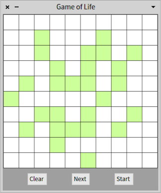

# SmalltalkWithFun

Learning Smalltalk with fun. 

Cool sample projects to learn from. 

Works on Pharo Smalltalk.

## Loading

In a _PlayGround_ window, evaluate this:

```smalltalk
Metacello new
	githubUser: 'sebnozzi' project: 'SmalltalkWithFun' commitish: 'master' path: 'src';
	baseline: 'SWF';
	load.
```

## Exploring

Open a _System Browser_ and explore the classes in packages:

* SWF-Example-xxx
* SWF-Library-xxx

Or play around with a "game-of-life" implementation by evaluating:

```smalltalk
GameOfLifeMorph play.
```

Then you can play with the "game-of-life" simulator:



---

Have fun with Pharo Smalltalk!
